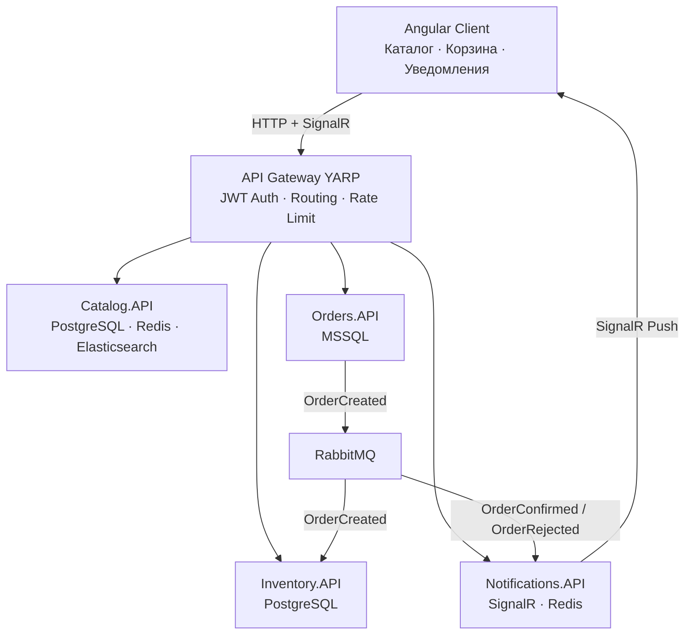

# AutoParts B2B Platform

B2B платформа для оптовых закупок автозапчастей на микросервисной архитектуре.


## Архитектура

## Стек технологий

| Слой | Технологии |
|------|-----------|
| Backend | .NET 10, ASP.NET Core, EF Core |
| Frontend | Angular 18, SignalR |
| Базы данных | PostgreSQL, MSSQL, Redis, Elasticsearch |
| Messaging | RabbitMQ, MassTransit |
| Gateway | YARP Reverse Proxy, JWT |
| Observability | Prometheus, Grafana, Serilog, ELK |
| Infrastructure | Docker, Docker Compose, Kubernetes |
| CI/CD | GitHub Actions |
| Tests | xUnit, Moq, FluentAssertions |


## Сервисы

| Сервис | Описание | БД |
|--------|----------|----|
| **API Gateway** | Единая точка входа, JWT авторизация, маршрутизация | — |
| **Catalog.API** | Каталог запчастей, поиск по Elasticsearch, Redis кэш | PostgreSQL |
| **Orders.API** | Создание и управление заказами, публикация событий | MSSQL |
| **Inventory.API** | Остатки на складе, резервирование товара | PostgreSQL |
| **Notifications.API** | Live уведомления через SignalR | Redis |

## Флоу создания заказа
```
Дилер выбирает запчасти в Angular → добавляет в корзину
Оформляет заказ → Orders.API сохраняет в MSSQL
Orders.API публикует OrderCreated в RabbitMQ
Inventory.API получает событие → проверяет остатки
├── Достаточно товара → резервирует → публикует OrderConfirmed
└── Недостаточно → публикует OrderRejected
Notifications.API получает событие → отправляет push через SignalR
Angular клиент получает уведомление в реальном времени
```

## Быстрый старт

### Требования
- [Docker Desktop](https://www.docker.com/products/docker-desktop/)
- [.NET 10 SDK](https://dotnet.microsoft.com/download)
- [Node.js 20+](https://nodejs.org/)

### Запуск инфраструктуры

```bash
# Клонировать репозиторий
git clone https://github.com/ShershenAA/TestShateM.git
cd TestShateM

# Поднять инфраструктуру и сервисы
docker compose up -d

# Запустить Angular клиент
cd angular-client
npm install
ng serve
```

### Запуск Angular клиента

```bash
cd angular-client
npm install
ng serve
```

Открой http://localhost:4200

### Запуск в Kubernetes (Minikube)

```bash
minikube start --driver=docker --memory=4096 --cpus=2

kubectl apply -f infra/k8s/namespace.yml
kubectl apply -f infra/k8s/configmaps/
kubectl apply -f infra/k8s/deployments/

# Получить URL Gateway
minikube service gateway -n autoparts
```

## UI адреса (Docker Compose)

| Сервис | URL | Credentials |
|--------|-----|-------------|
| Angular Client | http://localhost:4200 | dealer1 / password123 |
| API Gateway | http://localhost:5000 | — |
| RabbitMQ Management | http://localhost:15672 | autoparts / autoparts_pass |
| Grafana | http://localhost:3000 | admin / autoparts_admin |
| Kibana | http://localhost:5601 | — |
| Prometheus | http://localhost:9090 | — |

## Тестовые пользователи

| Логин | Пароль | Роль |
|-------|--------|------|
| dealer1 | password123 | Dealer |
| dealer2 | password123 | Dealer |
| admin | admin123 | Admin |

## Тесты

```bash
cd src/services
dotnet test AutoParts.sln --configuration Release
```

**20 unit тестов** покрывают ключевую бизнес-логику:
- `Catalog.API.Tests` — кэширование, CRUD, поиск (7 тестов)
- `Inventory.API.Tests` — резервирование товара, граничные случаи (5 тестов)
- `Orders.API.Tests` — создание заказов, отмена, публикация событий (8 тестов)

## Структура репозитория
```
TestShateM/
├── .github/workflows/ # GitHub Actions CI/CD
├── angular-client/ # Angular 18 SPA
├── docker-compose.yml # Вся инфраструктура одной командой
├── Dockerfile.* # Docker образы для каждого сервиса
├── infra/
│ ├── k8s/ # Kubernetes манифесты
│ ├── prometheus/ # Конфигурация Prometheus
│ └── grafana/ # Дашборды и datasources
└── src/
├── Gateway/ # YARP API Gateway + JWT
├── Shared.Contracts/ # Общие события RabbitMQ
└── services/
├── Catalog.API/
├── Orders.API/
├── Inventory.API/
└── Notifications.API/
```
## CI/CD
```
GitHub Actions запускается на каждый push в `main`:
push → test-backend (dotnet test) ─┐
       → test-frontend (ng build) ─┴→ build-images (docker build x5)
```

